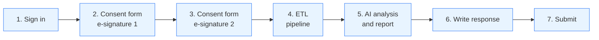
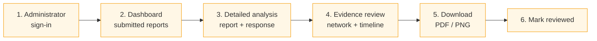
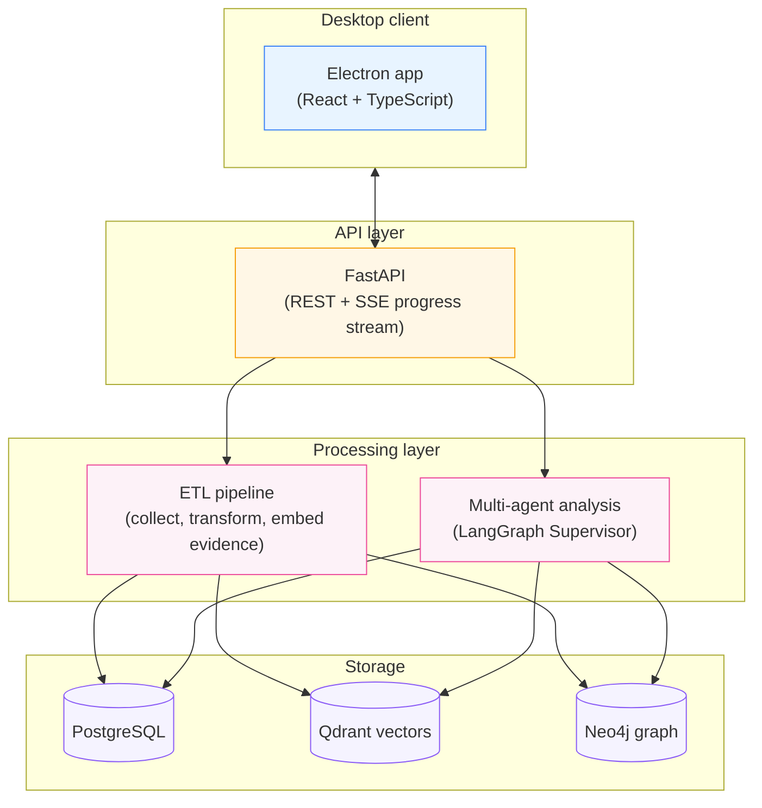
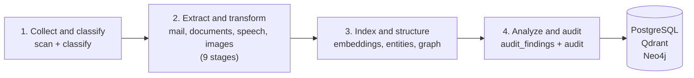
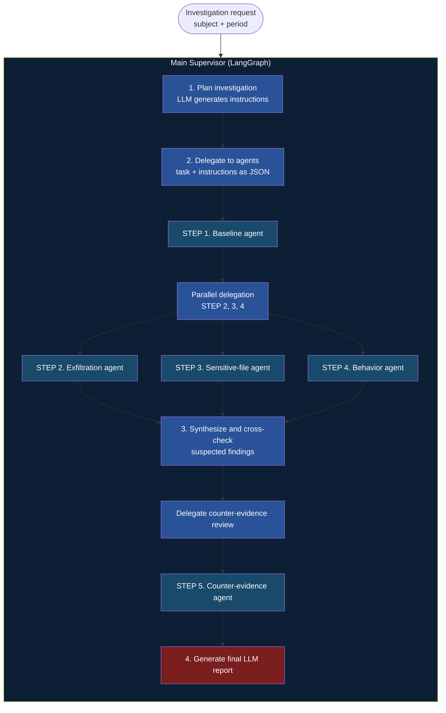

> A multi-agent desktop application for internal information security self-audits, with employee consent and an opportunity to respond to findings.

A Hallym University School of Software capstone project at the Intelligent Decision Systems Lab (LIT LAB). I led the three-person team and handled the architecture, multi-agent analysis, ETL pipeline, and presentation.

## My contribution and implementation

- **Evidence ETL:** Built a 16-stage pipeline that processes a provided CTF C-drive dataset and loads evidence into PostgreSQL, Qdrant, and Neo4j according to each store's purpose.
- **Agent system:** Designed and implemented the overall orchestration and result synthesis, and built the baseline, behavioral analysis, and counter-evidence agents.
- **Validation data:** Created three simulated scenarios and expected risk levels in virtual machines, then checked that the system's decisions matched all three.
- **Team leadership and presentation:** Coordinated development direction, prepared the presentation materials, and delivered the final presentation.

The measured change from about **8 minutes to 2–3 minutes** applies to the **agent analysis stage**. Agreement on three simulated scenarios is not a measure of detection accuracy in a real organization.


The diagram summarizes how evidence collection, ETL, storage, agent analysis, and result review connect.

## Project overview

**AUTH** is an **internal information security self-audit system** designed for employees to consent to periodic AI-assisted reviews of their work activity and respond to the findings.

Rather than one-sided surveillance, the goal is a **transparent self-audit process based on employee consent** that helps an organization strengthen compliance.

### Who uses it?

| Role | Workflow |
|---|---|
| **Employee** | Join a quarterly review → electronically sign consent forms → inspect AI findings → submit a written response if needed. |
| **Administrator** | Check submitted reports in the inbox → review explanation, evidence, network graph, and timeline → download a PDF report → mark the review complete. |

---

## Core features

### Employee workflow



- **Sign-in:** Employee ID.
- **E-signature 1:** Consent to inspect the work PC, files, and company email.
- **E-signature 2:** Consent to access messenger and personal email.
- **ETL → AI analysis:** Live progress through SSE.
- **Report review:** Suspicious files, email, and behavior patterns visualized.
- **Response:** Free-text explanation of the AI finding.

### Administrator workflow



- **Dashboard:** Filterable inbox by status and need for an employee response.
- **Detailed review:** Employee report and response, suspicious files and email bodies in modals, evidence network graph, and behavioral timeline.
- **Downloads:** PDF report and PNG network graph.
- **Completion:** Change the review status in the employee inbox.

---

## System architecture



---

## ETL pipeline in brief

A 16-stage pipeline scans one evidence disk and loads data into **three kinds of stores: relational, vector, and graph databases** (`STAGES_BASE` in `etl/pipeline.py`).



| Conceptual step | Actual stages | Purpose |
|---|---|---|
| 1. Collect and classify | `scan`, `classify` | Scan the disk and group files and mail by type. |
| 2. Multi-format extraction and transformation | Nine stages | PST/OST, HWP↔HWPX, DOC↔DOCX, STT (CLOVA), and vision. |
| 3. Index and structure | `upstage_embeddings`, `entity_extract`, `graphdb_load` | Embeddings → entities → graph load. |
| 4. Analyze and audit | `audit_findings`, `audit`, `complete` | Quality audit and completion. |

### Rerun only the failed stage

All 16 stages use **one execution wrapper**.

```python
def run_stage(job_id, stage_name, fn, *args) -> dict:
    set_stage(job_id, stage_name, "running")
    try:
        result = fn(*args) or {}
    except Exception as exc:
        set_stage(job_id, stage_name, "failed", error=str(exc)[:500])
        raise                       # Retain the failure point in the database.
    set_stage(job_id, stage_name, "done", processed=..., success=..., failed=...)
```

Stage state and elapsed time are recorded in `ingest_stage_runs`, allowing a job to **resume from the point of interruption** instead of reprocessing a disk of tens of gigabytes. Optional flags (`process_audio`, `process_images`, `process_embeddings`, `process_entities`, `process_graphdb`) control individual stages.

---

## Multi-agent analysis

A LangGraph Supervisor dynamically coordinates **five specialist sub-agents**.

### The Main Supervisor's four-step cycle



### Five specialist agents

| # | Agent | Role | Main stores |
|---|---|---|---|
| 1 | **Baseline** | Establish normal external-mail, file-execution, and activity patterns. | PostgreSQL |
| 2 | **Exfiltration detection** | Analyze messages sent through external mail, personal mail, messengers, and anonymous channels. | PostgreSQL + Qdrant |
| 3 | **Sensitive files** | Classify contracts, personnel files, and confidential documents through semantic vector search. | Qdrant + Neo4j |
| 4 | **Behavioral analysis** | Find out-of-scope access, unusual hours, and concealment patterns. | PostgreSQL |
| 5 | **Counter-evidence** | Recheck all areas for legitimate work and reduce false positives. | PostgreSQL + Qdrant + Neo4j |

### Final risk rating

After synthesis, a **weighted quantitative score** assigns one of four levels: **HIGH / MEDIUM / LOW / CLEAN**.

---

## Validation and outcomes

| Measure | Result |
|---|---|
| **Simulated scenarios** | The expected risk levels matched system decisions in **3/3** virtual-machine scenarios. |
| **Agent analysis stage** | Measured reduction from about **8 minutes to 2–3 minutes** by parallelizing exfiltration, sensitive-file, and behavior agents. |
| **False-positive controls** | The counter-evidence agent checks shared folders and colleagues' documents before unrelated evidence contributes to a decision. |

### Parallel execution

The Baseline Agent first establishes ordinary activity. Three independent agents then run through `ThreadPoolExecutor(max_workers=3)` (`agent/graph.py`). The Counter-evidence Agent runs after their results are synthesized.

```text
Baseline --+--> Exfiltration --+
           +--> Sensitive file -+--> Synthesis --> Counter-evidence --> Final report
           +--> Behavior -------+
           (three parallel workers)
```

### Design decisions

- **Sensitive-file scope:** Adopt as evidence only files under the subject's paths and above a sensitivity threshold, rather than every search hit. This avoids rating someone based on shared folders or a colleague's documents.
- **Baseline window:** Exclude **the final 30 days before departure** from the baseline. Mixing a suspicious period into normal behavior would compromise the reference.
- **Risk-rating authority:** Agents gather evidence; **code calculates the risk level using weights**. The Counter-evidence Agent checks facts and can lower the score.

---

## Technology

| Layer | Technology |
|---|---|
| **Frontend** | React 18 · TypeScript · Vite · Electron · @xyflow/react · @tanstack/react-query |
| **Backend** | FastAPI · LangGraph · LangChain · LangSmith · Pydantic |
| **Stores** | PostgreSQL · Qdrant · Neo4j |
| **AI services** | GPT-family LLM · Upstage embeddings · CLOVA STT |
| **Document parsing** | pdfplumber · python-docx · python-evtx · extract-msg · hwp.js |
| **Infrastructure** | Docker · electron-builder for Windows .exe distribution |

---

## Data handling and privacy

The system is designed around **employee consent for self-audits**.

- **Two e-signatures:** Separate consent for the system review and for messenger/personal-email access.
- **Defined collection scope:** Consent forms state which data are inspected, including file access history, sent email, and messenger logs.
- **Local evidence processing:** Evidence is processed on local Docker infrastructure and is not sent out. **Some text may be transmitted to an external LLM API for inference**, with separate notice when used.

---

## Limitations and reflection

The three virtual-machine scenarios and the measured agent-analysis time describe a bounded validation. Long-term effectiveness in a real organization needs separate evaluation. Some AI inference may use external APIs, so the product is designed to disclose that scope. Evidence review and the chance for an employee response are part of the workflow, not just the risk score.

The project received a Bronze Prize at Hallym University's Spring 2026 SW Capstone Design Competition (SW-Centered University Project, June 5, 2026).
